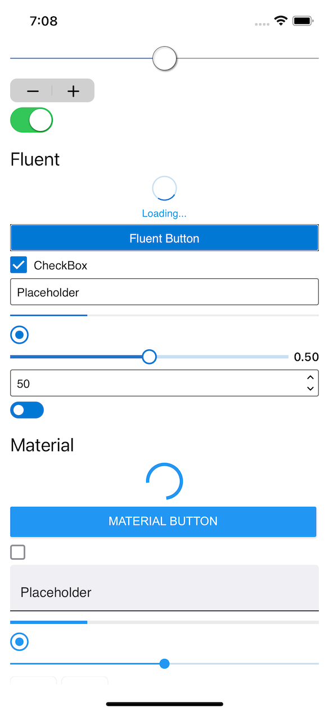
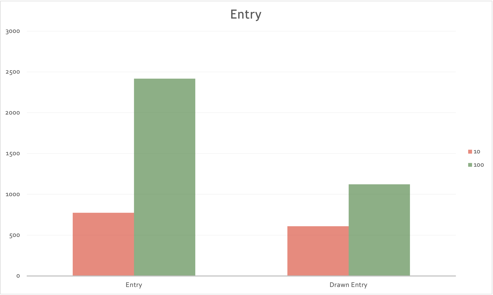

# GraphicsControls

Xamarin.Forms allows you to define the user interface once for multiple platforms. It offers an abstraction layer that is converted on each platform into native controls.

While the native controls proposal is great as it offers the native experience (appearance, performance, etc). it has certain adjacent limitations like customization possibilities etc.

_What if you could choose at any time between using the native control or a drawn control with the native look and feel?_

**GraphicsControls** is a library that offers the controls available in Xamarin.Forms Visual allowing to choose between **Cupertino, Fluent and Material** but, instead of creating native controls, are **drawn controls**.

 

There is currently support for:
* **iOS** using CoreGraphics
* **macOS** using CoreGraphics
* **Android** using Android Graphics

Soon, support will be added to:
* **UWP** using Win2D
* **Linux** using SkiaSharp
* **Tizen** using SkiaSharp
* **WPF** using SharpDX

#### System.Graphics

This project is using **System.Graphics**.
System.Graphics is a cross-platform graphics library for iOS, Android, Windows, macOS and Linux completely in C#. With this library you can use a common API to target multiple abstractions allowing you to share your drawing code between platforms, or mix and match graphics implentations within a singular application.

## What controls are available?

Currently there are the following controls:
* **ActivityIndicator** (Cupertino, Fluent, Material)
* **BoxView**
* **Button** (Cupertino, Fluent, Material)
* **CheckBox** (Cupertino, Fluent, Material)
* **Entry** (Cupertino, Fluent, Material)
* **ProgressBar** (Cupertino, Fluent, Material)
* **RadioButton** (Cupertino, Fluent, Material)
* **Slider** (Cupertino, Fluent, Material)
* **Stepper** (Cupertino, Fluent, Material)
* **Switch** (Cupertino, Fluent, Material)

Upcoming controls:
* Editor
* DatePicker
* TimePicker

The controls have the same properties and events as those existing in Xamarin.Forms.  

## Features

The main features are:

#### Drawn controls

The controls are drawn getting a pixel perfect option to adjust in the same way on all the platforms.

 

#### Easy to extend

_Do you want to extend a drawn control?_ Create your own control class, inherit from the drawn control and override the **Draw** method.

#### Dark Theme support

All controls, in the different visual modes (Cupertino, Fluent and Material) supports both light and dark theme.

 

#### RTL support (Work in progress)

All controls support RTL.

 

#### Mobile & Desktop support

 

#### Performance

Some native controls are complex. For example, Entry using Visual Material is made up of different elements. When using it, each of the different elements must be instantiated (the text box, the placeholder text, etc.). Using the drawn control, create an instance of a Canvas and draw the content. The time required to instantiate etc is shorter.

 

## Goals

* Have pixel-perfect drawn controls working on all the Xamarin.Forms supported platforms.
* High performance and customization options controls.