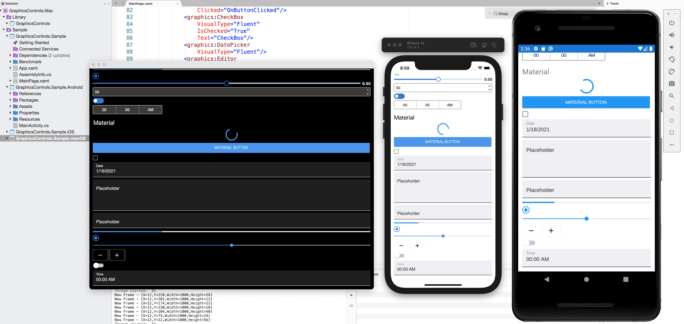
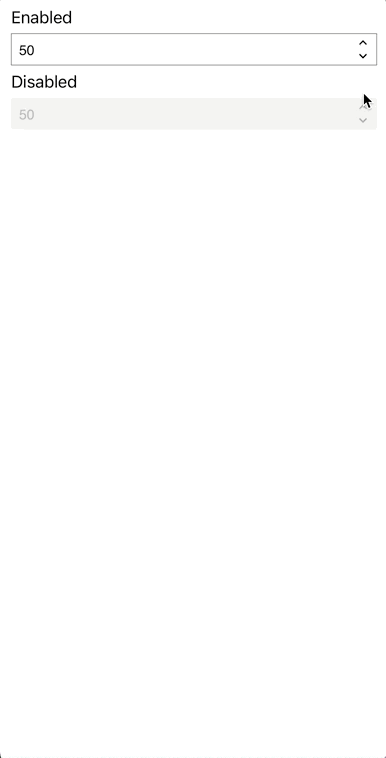
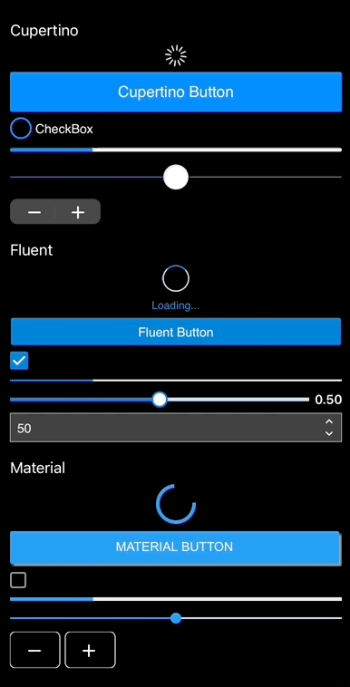
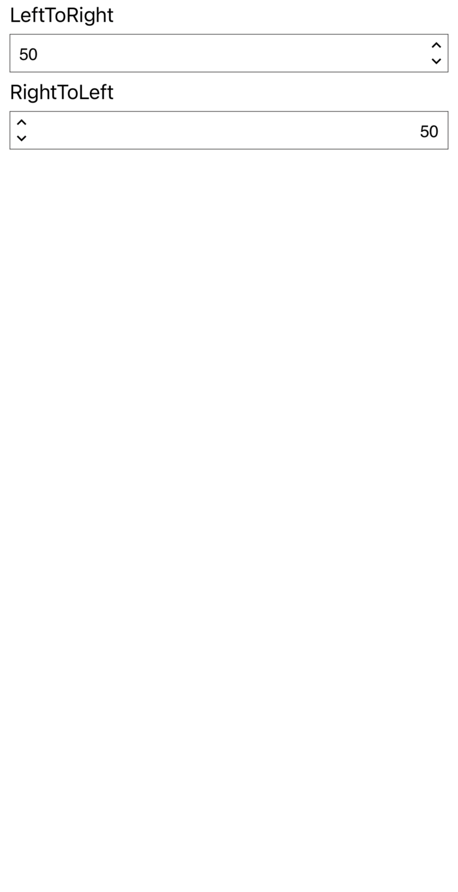

# Microsoft.Maui.Graphics.Controls: Pixel-Perfect Drawn Controls for .NET MAUI

[](https://dev.azure.com/devdiv/DevDiv/_build/latest?definitionId=14477&repoName=dotnet%2FMicrosoft.Maui.Graphics.Controls&branchName=main)

Microsoft.Maui.Graphics.Controls is a **.NET MAUI experiment** that offers cross-platform, pixel-perfect, drawn controls, with three built-in themes: **Cupertino**, **Fluent** and **Material**.

 

**NOTE:** Want to see all of this in action? Have a look at this [video](https://www.youtube.com/watch?v=hLcpAgWCHf4)

#### Microsoft.Maui.Graphics

This project uses [Microsoft.Maui.Graphics](https://github.com/dotnet/Microsoft.Maui.Graphics) to draw the controls.  Microsoft.Maui.Graphics is a cross-platform graphics library for iOS, Android, Windows, macOS and Linux completely built in C#.

This library allows you to use a common API across multiple platforms allowing you to share your drawing code between them, or mix and match graphics implentations within a single application.

## How To Use This Library
At the moment this library is experimental. Because of this we are distributing it as a NuGet package on a separate feed (aka nightly).

If you want to try it out, add the nightly feed to your [NuGet sources](https://docs.microsoft.com/nuget/consume-packages/install-use-packages-visual-studio#package-sources) or [add a NuGet.config file](https://docs.microsoft.com/nuget/reference/nuget-config-file) like below and install the `Microsoft.Maui.Graphics.Controls` package.

```xml
<?xml version="1.0" encoding="utf-8"?>
<configuration>
  <packageSources>
    <clear />
    <add key="maui-graphics-controls-nightly" value="https://aka.ms/maui-graphics-controls-nightly/index.json" />
    <add key="NuGet.org" value="https://api.nuget.org/v3/index.json" />
  </packageSources>
</configuration>
```

After adding the Microsoft.Maui.Graphics.Controls package, modify the MauiProgram class to register the drawn control handlers:

```csharp
public static class MauiProgram
{
    public static MauiApp CreateMauiApp()
    {
        var appBuilder = MauiApp.CreateBuilder();

        appBuilder
            .UseMauiApp<App>()
            .ConfigureGraphicsControls());

        return appBuilder.Build();
    }
}
```

## What controls are available?

Currently, the following controls are available:

| Control | Cupertino | Fluent | Material |
| --- | :---: | :---: | :---: |
| Button | ✅ | ✅ | ✅ |
| CheckBox | ✅ | ✅ | ✅ |
| DatePicker | ✅ | ✅ | ✅ |
| Editor | ✅ | ✅ | ✅ |
| Entry | ✅ | ✅ | ✅ |
| ProgressBar | ✅ | ✅ | ✅ |
| RadioButton | ✅ | ✅ | ✅ |
| Slider | ✅ | ✅ | ✅ |
| Stepper | ✅ | ✅ | ✅ |
| Switch | ✅ | ✅ | ✅ |
| TimePicker | ✅ | ✅ | ✅ |

The controls above have the same properties and events as they exist in Xamarin.Forms/.NET MAUI today.

## Features

The main features are:

#### Drawn controls

The supported controls are fully drawn by using the **Microsoft.Maui.Graphics** library. This means you will get pixel perfect rendering on all supported platforms. Have a look at the `Stepper` control showing the `IsEnabled` state in the image below.

 

### Different Looks
Each control implements 3 looks: **Cupertino**, **Material** and **Fluent**. As you might have gotten from the names, these mimic the native look of iOS, Android and Windows respectively.

On top of that, you can easily add your own custom look and theming to each control as you wish.

#### Easy to extend

_Do you want to extend a drawn control?_ Create your own control class, inherit from the drawn control and override the **Draw** method. This allows you to implement your own drawing logic entirely.

```
public class CustomControl : GraphicsView
{
    public override void Draw(ICanvas canvas, RectangleF dirtyRect)
    {
        base.Draw(canvas, dirtyRect);
    }
}
```

However, if you just want to customize one part of a control, you just have to overwrite the method that draws the layer for this control.

```
public class CustomSlider : Slider
{
    protected override void DrawSliderThumb(ICanvas canvas, RectangleF dirtyRect)
    {
        base.DrawSliderThumb(canvas, dirtyRect);
    }
}
```

Additionally you can also add completely new layers, delete existing layers or reorganize the priority when drawing the layers to achieve the exact look and feel you're after.

#### Dark Theme support

All controls, in the different visual modes (Cupertino, Fluent and Material) supports both light and dark theme. Below you can see an example of various controls switching between the two modes.

 

#### RTL support (Work in progress)

All controls support Right-To-Left (RTL) out of the box. Have a look at the `Stepper` control showing both RTL and LTR in the image below.

 

#### Mobile & Desktop support

The implemented controls are useable on both mobile and desktop platforms. In the image below you can see an example of the controls running on macOS.

 

#### Accessibility support

Building an accessible application ensures that the application is usable by people who approach the user interface with a range of needs and experiences.

With these controls you will be able to set properties to influence the native accessibility features on each platform. This way we can make apps the best experience for everyone.

(Work in progress)

#### Performance

Some native controls are complex. For example, Entry using Visual Material is made up of different elements. When using it, each of the different elements must be instantiated (the text box, the placeholder text, etc.). Using the drawn control, create an instance of a Canvas and draw the content. The time required to instantiate etc is shorter.

## Goals

* Have pixel-perfect drawn controls working on all the .NET MAUI supported platforms.
* High performance and customization options controls.

## Contributing

As an experimental project, there are several active areas of development and we're looking for your feedback to help set the direction for this project. Please check it out and let us know any feedback you have on the project by logging issues in this repo.

If you want to help develop this library, have a look at the issues that are labeled `help wanted`, `community` or `good first issue`.

Thank you!

## Copyright and license

All code is released under the [MIT license](https://opensource.org/licenses/MIT).
